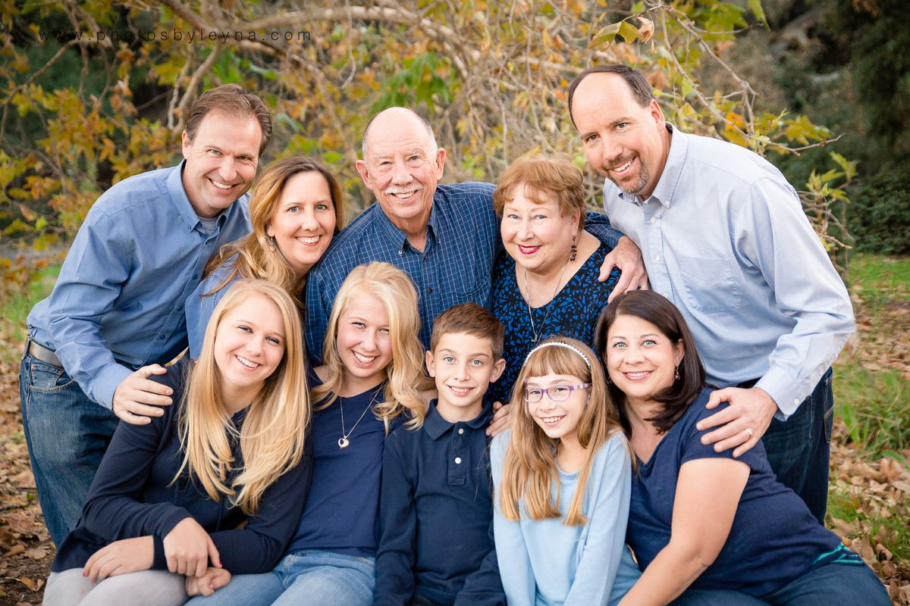
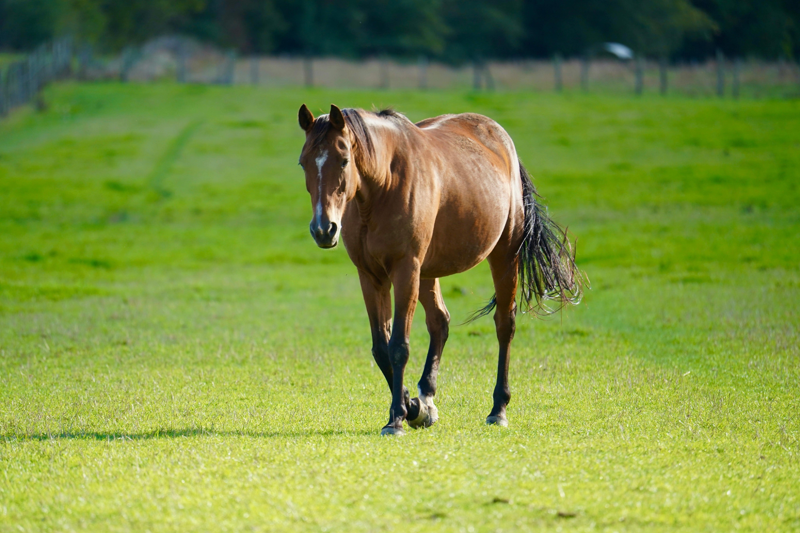
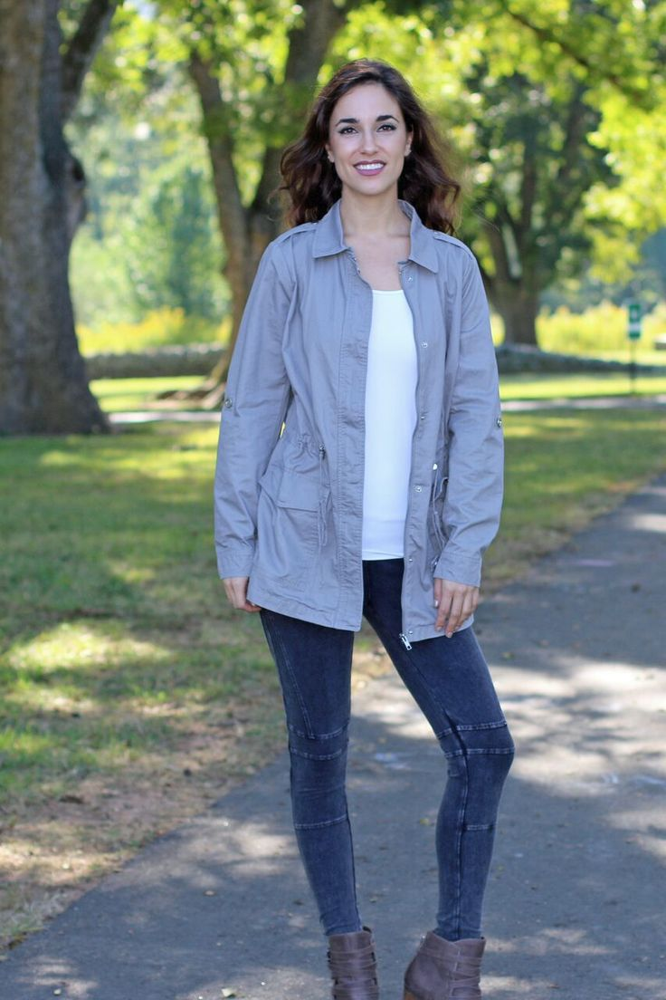
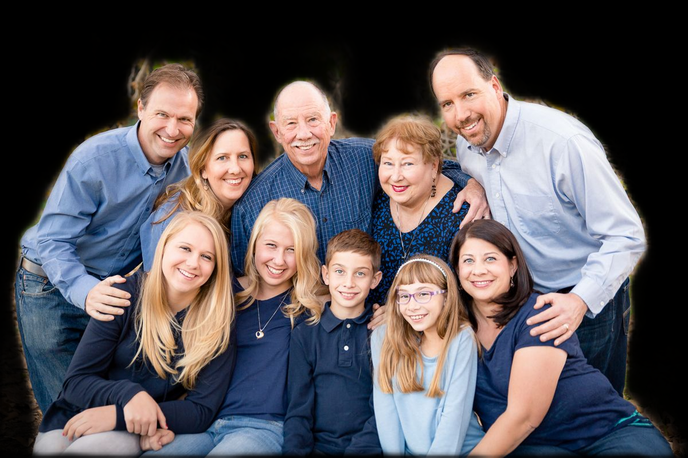

# VisionExtract: AI-Powered Subject Isolation System


[](https://www.python.org/)
[](https://pytorch.org/)
[](https://streamlit.io/)
[](https://opencv.org/)

## 🎯 Project Overview

**VisionExtract** is a specialized machine learning solution designed to automatically detect and extract the main subject from any given image. Built for professional automation, the system isolates the foreground subject and renders the background pixels as complete black, creating a high-fidelity "cutout" for use in digital art, photography, and augmented reality.

### 📝 Project Statement
> "The goal of this project is to build a machine learning model capable of automatically extracting the main subject from an image. The output is a new image where only the subject is displayed as in the original photo, while the rest of the pixels are set to black."

---

## 🚀 Key Features

*   **⚡ Automated Subject Isolation**: Intelligent detection and extraction of primary subjects across diverse categories.
*   **🧩 Aspect-Ratio Awareness**: Advanced preprocessing using **LongestMaxSize** to ensure subjects maintain their natural proportions without distortion.
*   **🔄 Virtual Background Integration**: Real-world application of isolation technology allowing real-time subject matting onto Office, Nature, and Studio environments.
*   **🖼️ High-Fidelity Alpha Blending**: Smooth, anti-aliased edge transitions for professional-grade matting.
*   **📊 Production Dashboard**: A premium Streamlit-based interface featuring real-time performance metrics and batch processing capabilities.

---

## 🛠️ Technical Stack

*   **Architecture**: ResNet34-UNet (Transfer Learning)
*   **Framework**: PyTorch
*   **Preprocessing**: Albumentations (Standardized Evaluation Pipeline)
*   **Frontend**: Streamlit (AI Showcase Dashboard)
*   **Acceleration**: CUDA Support with AMP (Automatic Mixed Precision)

---

## 📖 Implementation Workflow

1.  **Architecture**: Utilizes a deep **UNet** structure with a pre-trained **ResNet34 backbone** for high-precision spatial feature extraction.
2.  **Training**: Optimized over **110 epochs** using **IoU-based checkpointing** to ensure the most accurate weights.
3.  **Inference**: A standardized 256px resolution pipeline ensures architectural consistency and sub-second processing speeds.

---

## 📉 Performance Benchmarks

Following a **110-epoch training cycle** (including a 10-epoch **Refinement Phase** at an optimized learning rate of `0.00005`), the model achieved the following benchmarks:

| Metric | Achievement |
| :--- | :--- |
| **Model Architecture** | **ResNet34-UNet** |
| **Mean IoU** | **0.64+** |
| **Dice Score** | **0.78+** |
| **Inference Time** | **~0.15s (GPU accelerated)** |

---

## 🖼️ Visual Results (Gallery)

The following samples from the `outputs/` folder demonstrate the final refined output:

| Input Image | Isolated Subject (VisionExtract) |
| :---: | :---: |
|  |  |
|  |  |
|  |  |

---

## 📂 Project Structure

```text
VisionExtract/
├── src/                  # Production Logic (Model, Training, Inference, App)
├── outputs/              # Sample Results (Inputs & Predicted Cutouts)
├── docs/                 # Project Assets (Banners, Backgrounds, Documentation)
├── checkpoints/          # Trained Model Weights (.pth)
├── requirements.txt      # Dependency Configuration
└── README.md             # Technical Overview
```

---

## 🏃 Getting Started

### 1. Environment Setup
```bash
git clone https://github.com/biswajeet111/VisionExtract.git
cd VisionExtract
python -m venv venv
venv\Scripts\activate
pip install -r requirements.txt
```

### 2. Launching the Web Showcase
Experience the real-time extraction engine and background switcher.
```bash
streamlit run src/app.py
```

### 3. Command Line Interface (CLI)
```bash
# Single Image Processing
python src/inference.py --image path/to/sample.jpg --display
```

### 4. Model Training & Refinement
```bash
# Full Training Cycle
python src/train.py
```

---

## 👤 Author

**Biswajeet Kumar**
*   **Portfolio**: [GitHub](https://github.com/biswajeet111)
*   **Connect**: [LinkedIn](https://www.linkedin.com/in/biswajeet-kumar-a70043362)

---

*Developed as a high-performance solution for Automated Subject Isolation and AI Segmentation.*
