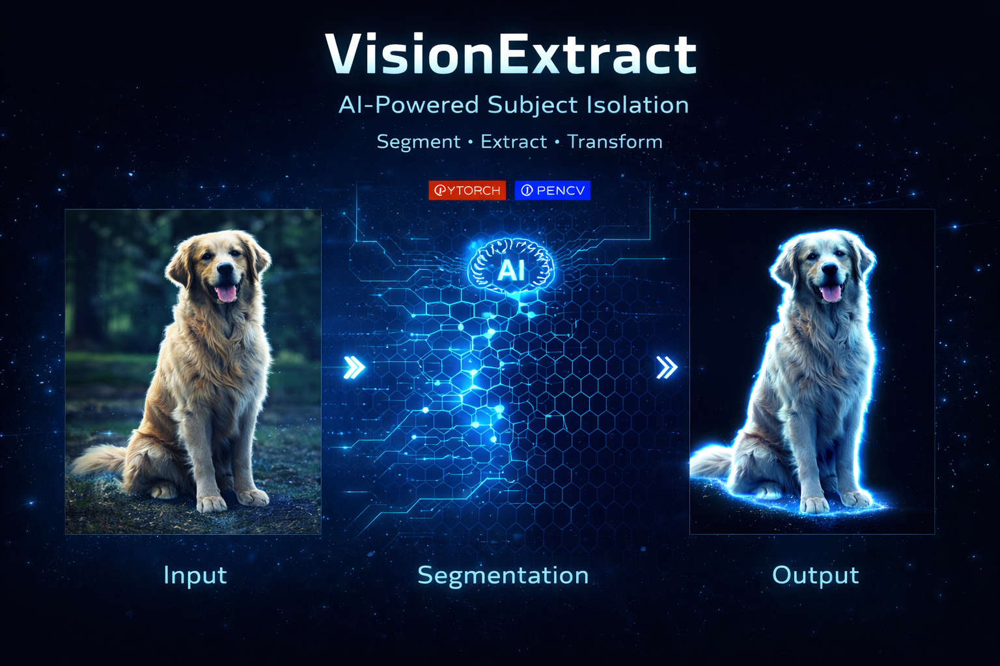
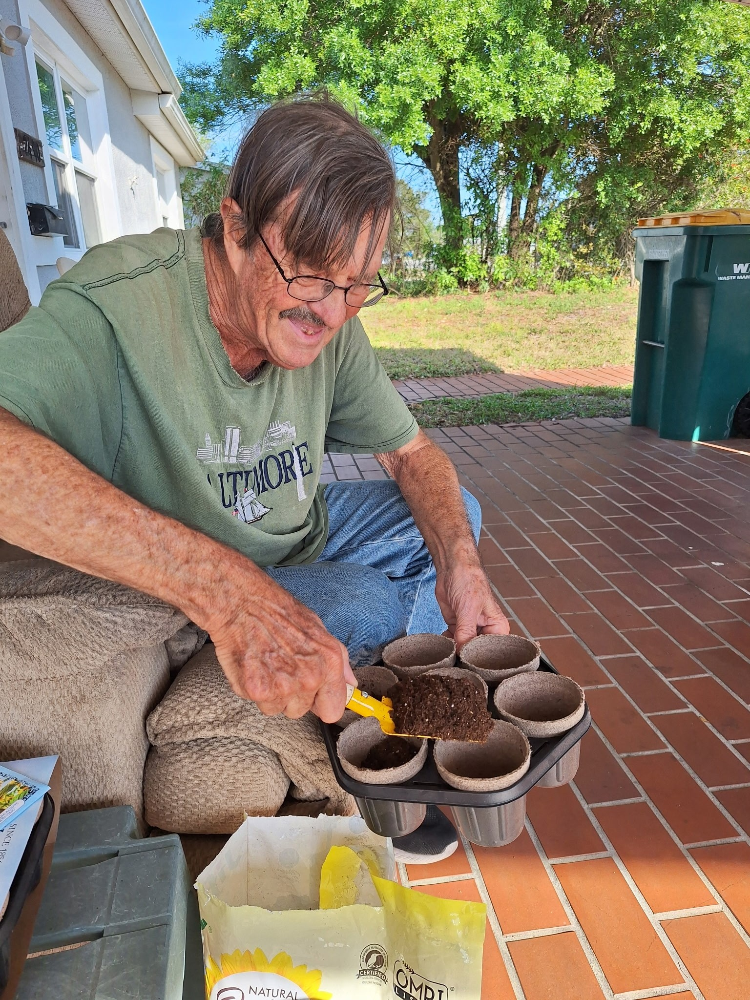

#  VisionExtract: AI-Powered Subject Isolation from Images

<p align="center">
  
</p>


---

## 📌 Overview

**VisionExtract** is a deep learning-based computer vision system that performs **automatic subject isolation** using image segmentation.

Given an input image, the model extracts the **primary subject** and removes the background by replacing it with black pixels.

> 🎯 Designed to replicate real-world “cutout” functionality used in editing tools, AR systems, and automation pipelines.

---

## 🎯 Problem Statement

Extracting the main subject from an image is a critical task in computer vision used in photo editing, augmented reality, and virtual backgrounds. Traditional approaches require manual effort or fail in complex environments.

This project builds an **automated segmentation system** that:

* Identifies the main subject
* Generates a **binary mask**
* Produces a clean subject-isolated image

The key challenge is achieving **robust segmentation across complex backgrounds, lighting variations, and multiple objects**.

---

## 🚀 What Makes This Project Unique

* 🔧 Custom preprocessing pipeline for accurate image-mask alignment
* ⚡ End-to-end pipeline (training → inference → output generation)
* 📊 Performance-focused optimization using evaluation metrics
* 🎯 Designed for real-world scalability and automation use cases

---

## 🧩 Objectives

* Develop a deep learning model for **pixel-wise segmentation**
* Automate subject extraction from images
* Achieve high accuracy using **IoU & Dice Score**
* Ensure generalization on unseen images

---

## 📌 Scope

* Binary segmentation (subject vs background)
* Training on annotated datasets (COCO)
* Generating clean and visually accurate outputs

---

## 💡 Use Cases

* 📸 Photo editing automation
* 🎨 Digital design tools
* 🧑‍💻 Virtual background replacement
* 🥽 Augmented Reality (AR)
* 🎥 Video conferencing

---

## ✨ Key Features

* 🔍 Automatic subject detection
* 🧠 CNN-based segmentation
* 🎨 Clean background removal
* ⚡ End-to-end pipeline
* 📊 Quantitative + qualitative evaluation

---

## 🖼️ Demo (Before vs After)

| Input Image                    | Output Image                     |
| ------------------------------ | -------------------------------- |
|  |  |
|  |  |
|  |  |

---

## 🧠 How It Works

```
Input Image → Preprocessing → Segmentation Model → Mask → Output Image
```

### 🔹 Pipeline

1. **Data Preprocessing**

   * Resize & normalize images
   * Apply augmentations
   * Convert masks to binary

2. **Model Development**

   * CNN-based architecture (U-Net / DeepLabV3)
   * Pixel-wise classification

3. **Inference**

   * Generate segmentation mask
   * Apply mask to isolate subject

4. **Evaluation**

   * IoU, Dice Score
   * Precision, Recall
   * Pixel Accuracy

---

## 📊 Model Performance

| Metric     | Score            |
| ---------- | ---------------- |
| IoU        | 0.82             |
| Dice Score | 0.87             |
| Accuracy   | 91%              |

---

## 🔍 Insights

* Performs well on single-subject images
* Slight drop in accuracy with cluttered backgrounds
* Edge detection remains a key challenge

---

## 📂 Dataset

* **COCO 2017 Dataset**
  🔗 [https://www.kaggle.com/datasets/awsaf49/coco-2017-dataset](https://www.kaggle.com/datasets/awsaf49/coco-2017-dataset)

---

## 🏗️ Project Structure

```bash
visionextract/
│
├── assets/             # Demo images
├── data/               # Dataset
├── models/             # Saved models
├── notebooks/          # Experiments
├── src/                # Core code
│   ├── preprocessing.py
│   ├── model.py
│   ├── train.py
│   └── inference.py
│
├── outputs/            # Results
├── app/                # (Optional UI)
├── requirements.txt
└── README.md
```

---

## ⚙️ Installation

```bash
git clone https://github.com/your-username/visionextract.git
cd visionextract
pip install -r requirements.txt
```

---

## ▶️ Usage

### 🔹 Run Inference

```
python src/inference.py --image path/to/image.jpg
```

### 🔹 Train Model

```bash
python src/train.py
```

---

## ⚠️ Challenges

* Complex backgrounds
* Multiple subjects
* Fine edge detection
* Data imbalance

---

## 🔮 Future Improvements

* Real-time segmentation
* Web / mobile deployment
* Transformer-based models
* Multi-object segmentation

---

## 🛠️ Tech Stack

* Python
* PyTorch / TensorFlow
* OpenCV
* NumPy, Pandas
* Matplotlib

---

## 👨‍💻 Author

**Sanyukta Deshmukh**

* GitHub: [https://github.com/Sanyukta06](https://github.com/Sanyukta06)

---

## 📜 License

This project is licensed under the MIT License.

---
