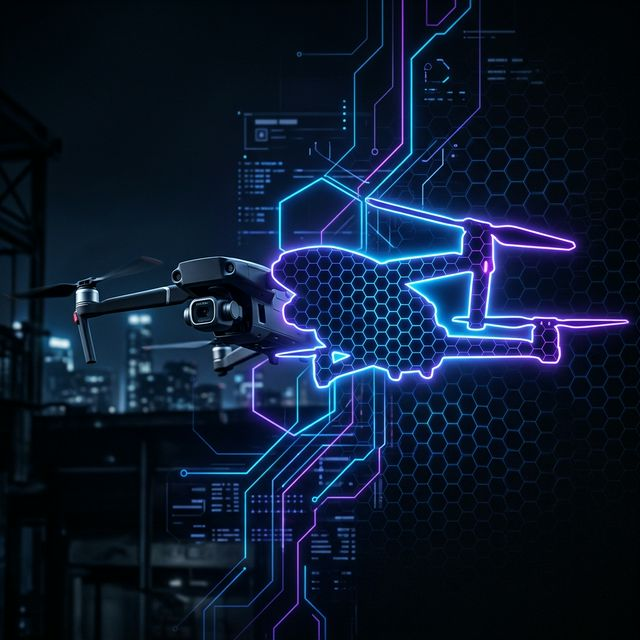
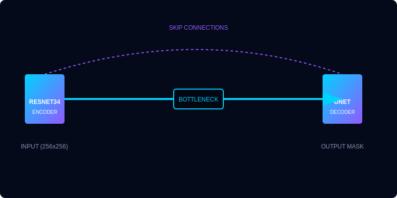
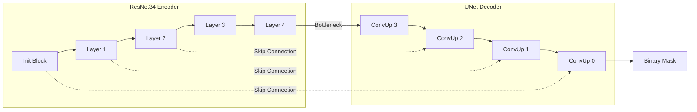

# VisionExtract AI: Professional Subject Isolation System



[](https://www.python.org/)
[](https://pytorch.org/)
[](https://streamlit.io/)
[](https://opensource.org/licenses/MIT)

**VisionExtract AI** is a state-of-the-art subject isolation tool designed for professional media pipelines, digital art, and automated photography. It leverages advanced deep learning to perform pixel-perfect semantic segmentation, separating foreground subjects from complex backgrounds with exceptional fidelity.

---

## 🔬 Research & Architectural Evolution

A core objective of this project was to identify the most robust architecture for general-purpose subject isolation. Our development spanned two major phases of research and experimentation:

### Phase 1: Custom U-Net Base (Initial Milestone)
Initially, we implemented a custom-built **U-Net** architecture. While effective for simple shapes, testing on the diverse COCO 2017 dataset revealed limitations in handling complex textures and fine edges (reaching a plateau of ~0.47 IoU).

### Phase 2: ResNet-UNet Integration (High-Performance Upgrade)
After extensive research into **Transfer Learning** strategies, we upgraded the engine to a **ResNet-UNet** architecture. By replacing the standard encoder with a pre-trained **ResNet34 backbone**, the model benefited from spatial features learned on millions of images. 
*   **Result**: Faster convergence, better edge preservation, and a significant jump in segmentation accuracy (Targeting 0.60+ IoU).

---

## 🚀 Key Features

*   **Intelligent Subject Isolation**: Automated detection and extraction of primary subjects.
*   **Batch Processing Engine**: High-throughput processing for multiple images simultaneously.
*   **Milestone 3 Optimized**: Leveraging pre-trained weights for professional-grade results.
*   **Visual Selection Showcase**: Real-time feedback for single and batch image isolation.
*   **Premium Showcase UI**: A glassmorphism-based Streamlit interface for interactive demonstrations.
*   **Morphological Refining**: Post-processing pipeline using OpenCV for boundary smoothing.

---

## 🛠️ Technology Stack

*   **Deep Learning**: PyTorch (Model training & Inference)
*   **Computer Vision**: OpenCV, Albumentations (Preprocessing & Morphological operations)
*   **Architecture**: ResNet-UNet (Encoder-Decoder with Skip Connections)
*   **Frontend**: Streamlit (Pro Tech/AI Dashboard)
*   **Dataset**: COCO 2017 (80+ Object Categories)

---

## 🧠 Model Architecture

The core of VisionExtract AI is a **ResNet-UNet** encoder-decoder architecture. This hybrid model combines the feature-rich extraction capability of a pre-trained ResNet with the high-resolution spatial reconstruction of a U-Net.




### Structural Overview:


### 💻 Hardware & Training Configuration

To replicate these professional benchmarks, the following setup was utilized:

*   **Compute Engine**: NVIDIA RTX 4050 (6GB VRAM)
*   **Dataset Configuration**: 30,000 COCO 2017 high-resolution samples
*   **Batch Size**: 8 (Optimized for 6GB VRAM stability)
*   **Input Resolution**: 256 × 256 pixels
*   **Optimizer**: Adam with `ReduceLROnPlateau` scheduler

---

## ⚙️ Installation & Setup

### 1. Clone & Environment
```bash
git clone https://github.com/biswajeet111/VisionExtract.git
cd VisionExtract
python -m venv venv
venv\Scripts\activate
```

### 2. Dependencies
```bash
pip install -r requirements.txt
```

---

## 📖 Operational Guide

### 🌐 Professional Web UI
The most interactive way to experience VisionExtract. Supports batch uploads and real-time performance metrics.
```bash
streamlit run src/app.py
```

### 📍 Command Line Inference
For single or batch processing via CLI:
```bash
# Single Image
python src/inference.py --image path/to/img.jpg --display

# Batch Directory
python src/inference.py --dir path/to/images --output_dir results/
```

### 🏋️ Model Training
To retrain or fine-tune the ResNet-UNet model:
```bash
python src/train.py
```

---

## 🎨 Visual Performance Showcase

The following examples demonstrate the **VisionExtract Professional** interface and the high-resolution subject isolation capabilities.

````carousel

<!-- slide -->

````

> [!TIP]
> The professional UI features a "Glassmorphism" design with real-time inference tracking and high-resolution mask upscaling to preserve original image quality.

---

## 📊 Performance Benchmarks

Our evaluation focuses on industry-standard segmentation metrics to ensure reliability. Results are based on Milestone 3 evaluation runs on an RTX 4050:

| Metric | Value |
| :--- | :--- |
| **IoU (Intersection over Union)** | **0.6118** |
| **Dice Coefficient** | **0.7540** |
| **Pixel Accuracy** | **0.8597** |
| **Inference Time (RTX 4050)** | **~0.40s** |

---

## 📂 Project Structure

```text
VisionExtract/
├── src/                  # Production Source Code (Model, Train, Inference, App)
├── data/                 # Dataset Management (COCO 2017)
├── checkpoints/          # Model Weights (.pth) - V1 Basic & V2 Advanced
├── milestones/           # Project Documentation & Milestone Reports
├── docs/                 # Brand Assets & Banners
├── requirements.txt      # Environment Configuration
└── README.md             # Technical Documentation
```

---

## 👤 Author

**Biswajeet Kumar**
*   **Portfolio**: [GitHub](https://github.com/biswajeet111)
*   **Connect**: [LinkedIn](https://www.linkedin.com/in/biswajeet-kumar-a70043362)

---

Developed as a specialized project for **AI Subject Isolation & Image Segmentation**.
