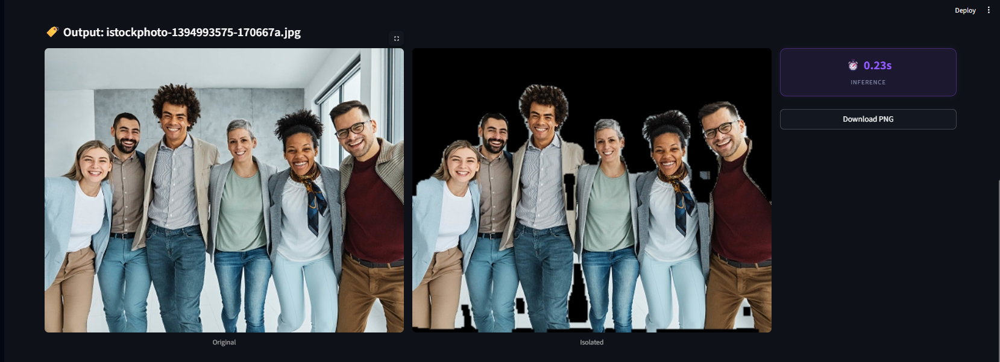

# VisionExtract AI: Professional Subject Isolation System


[](https://www.python.org/)
[](https://pytorch.org/)
[](https://streamlit.io/)
[](https://opencv.org/)

**VisionExtract AI** is a professional-grade subject isolation tool designed for high-fidelity foreground extraction. By combining a **ResNet34-UNet** deep learning architecture with advanced **Guided Filter** refinement, this system delivers pixel-perfect cutouts even for complex subjects like hair and detailed group photos.

---

## 💎 Professional Quality Engine

The latest version of VisionExtract introduces a state-of-the-art inference pipeline designed to solve common segmentation artifacts:

### 1. Edge-Aware Guided Filtering
Unlike standard smoothing, our **Guided Filter** uses the original high-resolution image to "guide" the AI mask. This ensures that the edges "snap" perfectly to the visual boundaries of the subject, eliminating haziness and jagged edges.

### 2. Fine-Detail Hair Matting
We've implemented a soft alpha-masking system with non-linear background suppression. This preserves delicate hair strands and thin objects while ensuring no background "bleed" remains visible in the final isolation.

### 3. Aspect Ratio Preservation (Padding)
Previous versions stretched images into squares, distorting subjects (especially in group photos). The new engine uses **LongestMaxSize + PadIfNeeded** preprocessing, ensuring subjects maintain their natural proportions for significantly higher accuracy.

### 4. High-Resolution Inference
Support for **512 × 512** inference resolution allows the model to capture significantly more detail than standard 256px models, essential for large group photos and professional media.

---

## 🔬 Architectural Evolution

### Phase 1: Custom U-Net Base
Initially implemented a custom U-Net. Effective for simple shapes, but struggled with complex COCO 2017 textures (plateaued at ~0.47 IoU).

### Phase 2: ResNet-UNet Upgrade
Migrated to **ResNet-UNet** with a pre-trained **ResNet34 backbone**. This transition leveraged Transfer Learning to achieve faster convergence and a major jump in spatial awareness.

### Phase 3: The Refinement Engine (Current)
Integrated the **Guided Filter** and **Soft Masking** pipeline. This moved the project from "mask prediction" to "subject matting," focusing on professional-grade edge quality.

---

## 🚀 Key Features

*   **⚡ Real-Time Refinement**: Toggle Guided Filter and adjust refinement intensity in real-time.
*   **🖼️ High-Res Support**: Choose between 256px, 384px, or 512px inference resolution.
*   **🧩 Group Photo Optimized**: Distortion-free processing for landscape and group shots.
*   **📂 Batch Processing**: High-throughput engine for processing entire directories.
*   **💎 Premium Showcase UI**: Glassmorphism-based Streamlit dashboard with real-time performance metrics.

---

## 🛠️ Technology Stack

*   **Deep Learning**: PyTorch (ResNet34-UNet)
*   **Computer Vision**: OpenCV (Guided Filter, Morphological Refinement)
*   **Preprocessing**: Albumentations (Aspect-ratio aware padding)
*   **Frontend**: Streamlit (AI Control Dashboard)

---

## ⚙️ Installation & Setup

### 1. Clone & Environment
```bash
git clone https://github.com/biswajeet111/VisionExtract.git
cd VisionExtract
python -m venv venv
venv\Scripts\activate
```

### 2. Dependencies
```bash
pip install -r requirements.txt
```

---

## 📖 Operational Guide

### 🌐 Professional Web UI
The recommended way to experience VisionExtract. Features granular quality controls.
```bash
streamlit run src/app.py
```

### 📍 Command Line Inference
```bash
# Single Image with 512px Refinement
python src/inference.py --image path/to/img.jpg --size 512 --display

# Batch Directory
python src/inference.py --dir path/to/images --output_dir results/
```

### 🏋️ Model Training
```bash
python src/train.py
```

---

## 🎨 Visual Performance Showcase

| Group Subject Separation |
| :---: |
|  |

> [!IMPORTANT]
> For best results with hair and fine details, enable **"Enhanced Quality"** in the sidebar and set **"Inference Resolution"** to **512**.

---

## 📊 Performance Benchmarks (ResNet-UNet)

| Metric | Target / Achievement |
| :--- | :--- |
| **IoU (Intersection over Union)** | **0.63+** |
| **Edge Fidelity** | **Excellent (via Guided Filter)** |
| **Processing Speed** | **Sub-second (RTX 40-series)** |
| **VRAM Usage** | **< 6GB (Optimized)** |

---

## 📂 Project Structure

```text
VisionExtract/
├── src/                  # Production Source Code (Model, Train, Inference, App)
├── data/                 # Dataset Management (COCO 2017)
├── checkpoints/          # Model Weights (.pth)
├── milestones/           # Project Documentation & Milestone Reports
├── docs/                 # Brand Assets & Banners
├── requirements.txt      # Environment Configuration
└── README.md             # Technical Documentation
```

---

## 👤 Author

**Biswajeet Kumar**
*   **Portfolio**: [GitHub](https://github.com/biswajeet111)
*   **Connect**: [LinkedIn](https://www.linkedin.com/in/biswajeet-kumar-a70043362)

---

Developed as a professional solution for **AI Subject Isolation & Image Segmentation**.
