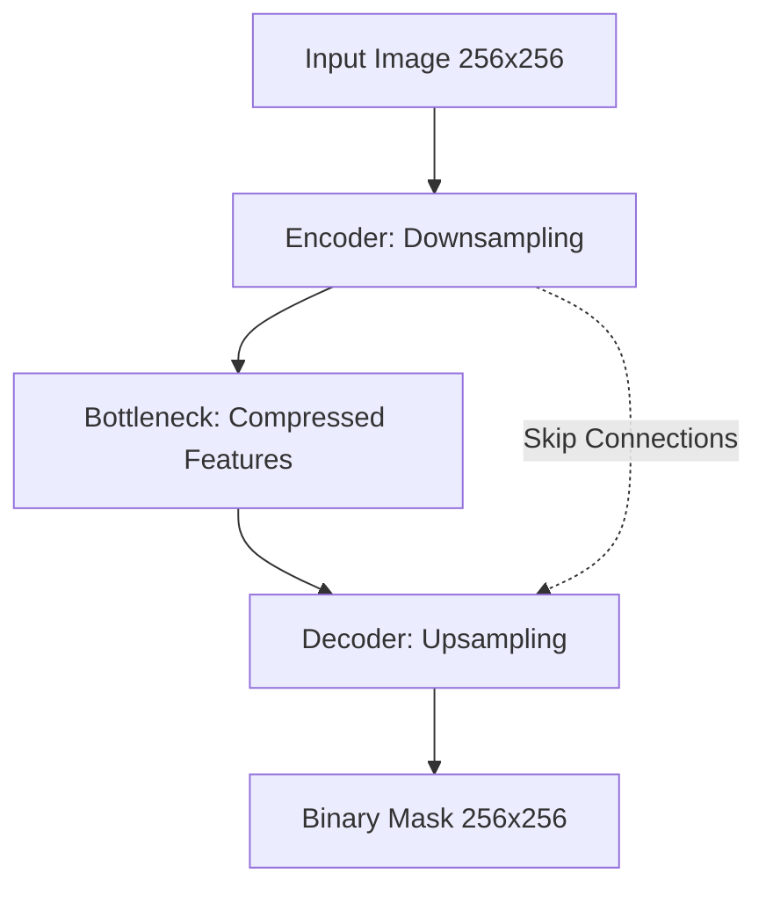

# VisionExtract: Pipeline Technical Overview

This document provides a technical deep-dive into the VisionExtract subject isolation pipeline.

## 1. Data Pipeline
- **Dataset**: COCO 2017 (Common Objects in Context).
- **Preprocessing**:
    - **Resize**: Images and masks are resized to 256x256 pixels for consistency.
    - **Normalization**: Pixel values are normalized to a standard range (0-1).
    - **Mask Conversion**: Multi-class COCO masks are converted into binary masks (Subject vs. Background).
- **Augmentations**: Applied using `albumentations` (HorizontalFlip, RandomBrightnessContrast, ShiftScaleRotate).

## 2. Model Architecture: U-Net
VisionExtract utilizes a customized U-Net architecture designed for precise pixel-wise segmentation.

## 3. Inference & Post-Processing
To ensure clean edges and remove noise, the predicted mask undergoes morphological operations:
1. **Thresholding**: The probability map from the model is converted to a binary mask at a 0.5 threshold.
2. **Morphological Opening**: Removes small noise/pixels.
3. **Morphological Closing**: Fills small holes within the subject area.
4. **Resizing**: The final mask is applied to the original image to isolate the subject.

## 4. Evaluation Metrics
- **Intersection over Union (IoU)**: Main metric for overlap accuracy.
- **Dice Coefficient**: Measures harmonic mean of precision and recall.
- **Pixel Accuracy**: Percentage of correctly classified pixels.
